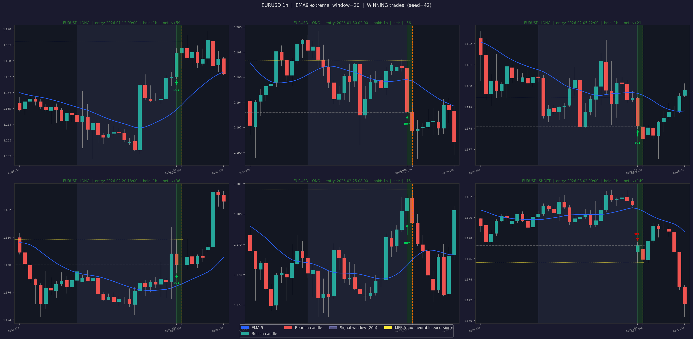
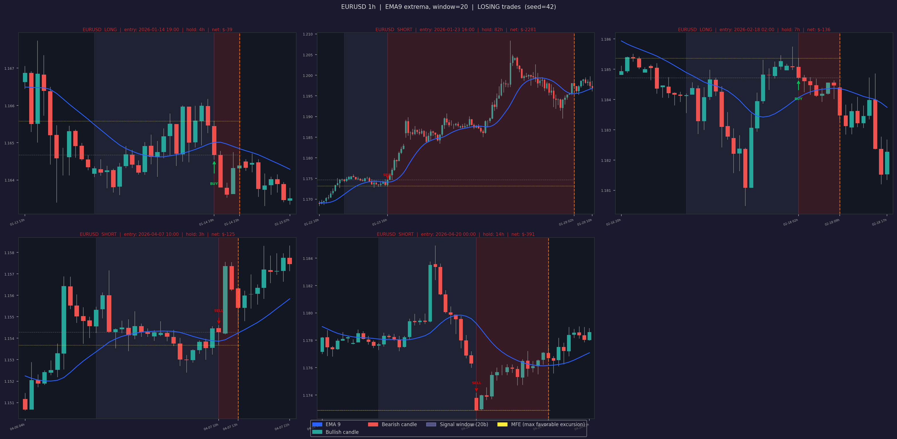

# EMA Strategy — Reference Document

**Strategy:** Double-EMA Extrema, 1h signal
**Account:** FTMO Swing $100 000 (login `1513349611`)
**Pairs:** EURUSD, AUDUSD, NZDUSD, USDCHF, USDCAD, GBPUSD, USDJPY, EURJPY
**Status:** Live (challenge-safe defaults: 0.5 lot, $1 000 daily stop, FTMO hedge & cumulative-correlation filter always on)

> **Heads up — May 2026 rewrite.** 5-minute signals were removed and FTMO-compliant hedge / cumulative-correlation filters were added. Most of the structural docs below are correct; the **backtest numbers in Section 6 are stale** (they were measured under the old 1h+5m configuration). Re-run before relying on them — see [Section 6](#6-backtest-results).

---

## Table of Contents

1. [Core Idea](#1-core-idea)
2. [Signal Logic](#2-signal-logic)
3. [Position Rules & FTMO Filters](#3-position-rules--ftmo-filters)
4. [Take-Profit & Stop-Loss](#4-take-profit--stop-loss)
5. [Parameters](#5-parameters)
6. [Backtest Results](#6-backtest-results)
7. [Risk Management](#7-risk-management)
8. [Files & Entry Points](#8-files--entry-points)
9. [Known Caveats](#9-known-caveats)

---

## 1. Core Idea

Price reverts after a clear local peak or valley in the smoothed trend line. The strategy:

1. Computes a **Double EMA of (High+Low)/2** — two EMA passes suppress noise without adding lag.
2. Looks for the **peak or valley** of that DEMA within a sliding window of recent bars.
3. Fires a SHORT when the peak is on the current or previous bar, a LONG when the valley is. Entry is on the same bar — no waiting for confirmation.
4. Runs on the **1h timeframe only**. (Earlier versions also fired on 5m; that was removed in May 2026 to comply with FTMO trade-frequency expectations and reduce hedging risk between fast intra-bar signals.)

---

## 2. Signal Logic

### Sample winning trades — EURUSD 1h (real backtest)



The blue line is the DEMA, the shaded blue band is the 20-bar lookback window, and the green/red shading marks the held trade. BUY arrows fire on a DEMA valley; SELL arrows on a peak. Yellow dotted line = max favorable excursion during the trade.

### Formula

```
hl2      = (High + Low) / 2
DEMA     = EMA( EMA(hl2, period), period )
window   = last W bars of DEMA
pos_max  = argmax(window)          # position of highest DEMA value
pos_min  = argmin(window)          # position of lowest DEMA value
```

### Signal rules

| Condition | Signal |
|-----------|--------|
| `pos_max > pos_min` AND `pos_max <= W − 1` | **SHORT** — peak is at or before current bar |
| `pos_min > pos_max` AND `pos_min <= W − 1` | **LONG** — valley is at or before current bar |
| `pos_max == pos_min` | No signal (flat EMA) |

The guard is `<= W − 1`, which allows the signal to fire on the same bar as the peak/valley — entering at the actual turning point. No look-ahead bias: the bar is confirmed closed before the signal is evaluated.

### EMA period

| Timeframe | `ema_period` | `window` |
|-----------|-------------|----------|
| 1h        | 9           | 20       |

EMA9 / W20 was the best OOS combination in the original sweep.

---

## 3. Position Rules & FTMO Filters

### Per-pair logic

| State | New 1h signal | Action |
|-------|---------------|--------|
| Flat  | Any           | Open position (subject to filters below) |
| Same direction | Same          | Hold — no action |
| Open in opposite direction | Opposite | If `bars_held ≥ min_bars_1h`: close → re-evaluate filters → maybe open opposite |

### FTMO hedge filter (always on)

Decomposes every position into per-currency exposure (`LONG EURUSD = {EUR:+1, USD:−1}`) and **blocks any new entry that would create OPPOSING exposure on a currency the bot already holds**.

| Open position | New signal | Result |
|---------------|------------|--------|
| LONG EURUSD   | SHORT GBPUSD | **Blocked** — would create opposing USD exposure |
| LONG EURUSD   | LONG  USDCHF | **Blocked** — would create opposing USD exposure |
| LONG EURUSD   | SHORT EURJPY | **Blocked** — would create opposing EUR exposure |
| LONG EURUSD   | LONG  GBPUSD | Allowed (same USD direction; see cumulative cap below) |
| LONG EURUSD   | LONG  EURJPY | Allowed (stacks EUR exposure; subject to cumulative cap) |

### Cumulative-correlation cap (`--max-ccy-exposure`, default 2)

Limits the **net per-currency exposure across all open positions**. Default 2 means at most 2 anti-USD positions (or 2 long-EUR, etc.) may be open at the same time. Prevents stacking the same trade-idea across multiple correlated pairs — which FTMO flags as a Risk-per-Trade-Idea violation.

If a flip-signal closes a position but the new direction is blocked by the filter, the pair stays **flat** rather than flipping. A flip is not always a flip.

### Lot sizes (live default — challenge-safe)

| Timeframe | Lots | Per pair |
|-----------|------|----------|
| 1h        | 0.5  | 0.5      |

Scale up only after live performance matches backtest:
- Phase 2 (validated): `--lots-1h 1.0`
- Phase 3 (full backtest size): `--lots-1h 2.0`

---

## 4. Take-Profit & Stop-Loss

### Sample losing trades — EURUSD 1h (real backtest)



Only **5 of 308** EURUSD 1h trades lost — the −40 pip SL caps each loss at ~$100 per 0.5 lot. The pattern: signal fires, price keeps moving against the entry past the lookback window's range, SL hits.

### Entry

| Direction | Entry price |
|-----------|-------------|
| LONG (BUY)  | **Ask** |
| SHORT (SELL)| **Bid** |

### TP and SL placement

| Position | Take-Profit | Stop-Loss |
|----------|-------------|-----------|
| 1h LONG  | `Ask + 10 pips` | `Ask − 40 pips` |
| 1h SHORT | `Bid − 10 pips` | `Bid + 40 pips` |

Both TP and SL are submitted with the entry order, so the broker manages them as resting limits — no monitoring loop required.

### Exit priority

1. **TP hit** (broker-side): position auto-closes when Bid ≥ TP (long) or Ask ≤ TP (short).
2. **SL hit** (broker-side): −40 pips caps tail risk at ~$100/trade per 0.5 lot.
3. **Opposite signal**: client polls every 30 s; closes at market on flip (subject to FTMO filters before re-opening).
4. **Daily stop**: client closes ALL positions if portfolio P&L < −$1 000.

### Cost model (EURUSD, 1 lot)

```
cost per trade = 2 × half_spread × pip_value + commission
               = 2 × 0.2 pip × $10 + $7  =  $11

Required move to break even (1 lot): 1.1 pips
Default 1h TP (10 pips) → ~$89 net per win
```

---

## 5. Parameters

### Signal parameters

| Parameter | Value |
|-----------|-------|
| `ema_1h` | 9 |
| `window` | 20 |

### Risk parameters (live defaults — challenge-safe)

| Parameter | Default | Notes |
|-----------|---------|-------|
| `lots_1h` | **0.5** | Quarter of Phase 3; cuts daily DD by 75% |
| `tp_1h_pips` | 10 | ~90% MFE hit rate on 1h |
| `sl_pips_1h` | 40 | Caps 1h tail risk at ~$100/trade per 0.5 lot |
| `min_bars_1h` | 2 | Whipsaw guard before allowing exit on opposite signal |
| `early_1h` | True | Enter on the peak/valley bar itself (Sharpe 57 vs 35) |
| `max_dist_pips` | 0 | Disabled — distance filter reduced Sharpe from 42 → 22 |
| `max_ccy_exposure` | **2** | FTMO cumulative-correlation cap (max 2 positions sharing any currency direction) |
| `daily_stop` | **1 000** | Portfolio USD daily loss limit (5× FTMO buffer) |

### Run with all defaults

```bash
python -m scripts.strategy_live_trader --login 1513349611 --server FTMO-Demo
```

That's it — no other flags needed. Set `MT5_PASSWORD` env var or pass `--password`.

---

## 6. Backtest Results

> ⚠️ **Numbers below are from the pre-rewrite combined 1h+5m strategy** (Apr 2026 measurement). They are kept here for historical reference and will overstate trade count and absolute P&L. The new 1h-only joint backtest with FTMO hedge & cumulative cap has not yet been run — re-run with:
>
> ```bash
> python -m scripts.strategy_combined_backtest \
>     --start 2026-01-01 --end 2026-05-07 --oos-start 2026-04-01 \
>     --max-ccy-exposure 2
> ```
>
> Expected directional changes vs the old numbers:
> - **Trade count**: lower (5m entries removed; some 1h entries blocked by FTMO filters)
> - **Sharpe**: similar or slightly higher (1h has the best trade Sharpe; 5m diluted it)
> - **Max DD**: lower in absolute terms (smaller cumulative position; hedge filter prevents same-bar opposing positions)
> - **OOS P&L**: lower in absolute terms (fewer trades), but per-trade EV should be unchanged

### Historical (combined 1h+5m, pre-rewrite)

**Period:** Jan 1 – May 7 2026 · IS: Jan–Apr · OOS: Apr–May 2026
**Backtest lots:** 2.0 (1h) + 1.0 (5m) — quadruple the live default

| Period | Trades | P&L | Win% | Sharpe | Max DD | Worst day |
|--------|--------|-----|------|--------|--------|-----------|
| IS  | 13 555 | +$738 400 | 91.9% | 65.47 | −$5 215 | −$2 270 |
| **OOS** | **4 945** | **+$252 352** | **91.4%** | **57.36** | **−$2 940** | **−$255** |

---

## 7. Risk Management

### FTMO Swing $100k limits

| Limit | FTMO threshold | Strategy buffer (live defaults) |
|-------|----------------|---------------------------------|
| Daily drawdown | $5 000 | Stop at $1 000 (5× buffer) |
| Total drawdown | $10 000 | Pending re-measurement after rewrite |
| Profit target | $10 000 | Pending re-measurement after rewrite |

### FTMO compliance (forbidden-practice rules)

The bot's design directly addresses each clause from the [FTMO Forbidden Trading Practices](https://ftmo.com/en/forbidden-trading-practices/) page:

| FTMO rule | How the bot complies |
|-----------|----------------------|
| "Hedging or holding opposing positions on the same or highly correlated instruments" | `_entry_blocked` rejects any signal whose currency decomposition opposes an existing position |
| "Cumulative exposure in a specific symbol or correlated symbols" | `--max-ccy-exposure` (default 2) caps net per-currency exposure |
| "More than 2 000 server requests per day" | 30 s poll cycle on 8 pairs ≈ 23 k order *checks* per day, but ≤ 100 actual order **requests** even on busy days (1h cadence) |
| "Trades operated by EAs that cause hyperactive accounts" | 1h-only signals → handful of trades per pair per day |
| "Gap trading… two hours or less before market close" | Friday 14:00 UTC entry cutoff; 20:00 UTC full close |

### Scale-up sequence

```
Phase 1 — Live defaults (current):
  All 8 pairs, 0.5 lot 1h, daily stop $1 000, max_ccy_exposure=2
  Goal: prove live fills match backtest. Pass FTMO challenge.

Phase 2 — Validated (after profitable challenge phase):
  Same pairs, 1.0 lot 1h, daily stop $2 500

Phase 3 — Full backtest size (after 4+ profitable weeks):
  Same pairs, 2.0 lot 1h, daily stop $5 000
```

### Daily circuit-breaker

```
Every 30 seconds:
  pnl = realized_today + unrealized_open_positions
  if pnl < -daily_stop_usd:
      close ALL positions (all pairs) at market
      halt new entries until midnight UTC
```

Uses `history_deals_get()` for realized P&L and live `positions_get()` for unrealized — reacts to floating losses, not just closed trades.

---

## 8. Files & Entry Points

| File | Purpose |
|------|---------|
| `scripts/strategy_ema_extrema_backtest.py` | Single-TF parameter sweep |
| `scripts/strategy_combined_backtest.py` | 1h backtest with joint FTMO sim — IS/OOS split |
| `scripts/analyze_mfe.py` | MFE distribution — calibrate TP levels |
| `scripts/strategy_live_trader.py` | Live MT5 trader |
| `scripts/visualize_ema_trades.py` | Chart viewer with DEMA overlay |
| `docs/diagrams/winners_1h_EURUSD.png` | 6 sample winning 1h trades (EURUSD) |
| `docs/diagrams/losers_1h_EURUSD.png` | All 5 losing 1h trades (EURUSD, SL hit) |

> The filename `strategy_combined_backtest.py` is preserved for shell-script compatibility but the simulator is now 1h-only. Old 5m diagrams (`winners_5m_EURUSD.png`, `losers_5m_EURUSD.png`) remain in `docs/diagrams/` as historical artifacts.

### Re-run backtest

```bash
python -m scripts.strategy_combined_backtest \
    --start 2026-01-01 --end 2026-05-07 --oos-start 2026-04-01 \
    --max-ccy-exposure 2
```

All recommended params (`ema_1h=9`, `sl_pips_1h=40`, etc.) are baked into defaults. Add `--per-pair` for the diagnostic isolated-pair sim (no FTMO filter — for debugging only, not representative of live behavior).

### Start live trader

```bash
# Live default — challenge-safe (0.5 lot, $1 000 daily stop, FTMO filter on)
python -m scripts.strategy_live_trader --login 1513349611 --server FTMO-Demo

# Single-pair validation (most conservative)
python -m scripts.strategy_live_trader --login 1513349611 --server FTMO-Demo \
    --pairs EURUSD --lots-1h 0.25 --daily-stop 500
```

---

## 9. Known Caveats

### `close_profit` fill assumption
Backtest exits use the intrabar High (long) or Low (short) the moment it crosses breakeven, assuming a resting limit order. Live execution depends on broker latency and spread at the TP touch. If live win% drops below 80% (vs 90% backtest), the TP is being missed and should be widened by 1–2 pips.

### Hard SL resolved at 1h close in backtest
The simulator checks the 1h bar's High/Low for SL hits, so intrabar SL excursions ARE detected. But the SL fill price is the SL level, not the exact tick where it was crossed — slippage is not modelled. Realistic, but expect ~1 pip of negative slippage on actual fills.

### OOS period is short
Apr–May 2026 = 31 trading days. Enough to validate, not enough to rule out lucky streaks. Re-run after 3–6 months of live data.

### Stop-loss (1h positions)
`--sl-pips-1h 40` caps tail risk at ~$100/trade per 0.5 lot. Backtest-optimal is no SL (Sharpe 51) but SL=40 gives Sharpe 42 with capped worst-case loss — preferable for challenge-safe trading.

### Distance filter (not recommended)
`--max-dist-pips 10` reduced OOS Sharpe from 42 → 22. Blocks entries during fast momentum that then continues — strategy performs better entering slightly late than not at all.

### `partial_usd` is harmful — keep disabled
Tested partial closes at half-position-profit threshold: OOS P&L dropped 36% with no improvement to max DD. Default is 0.

### FTMO hedge filter may turn flips into holds
If a flip signal closes a position but the new direction is blocked by the hedge or cumulative-cap filter (because of an open position on a correlated pair), the pair stays flat. This is intentional. Expect lower trade count than a pre-rewrite per-pair simulation would suggest.

### 1m and 5m timeframes excluded
1m and 5m signals were removed in May 2026: too few pips per trade to clear costs, and the high trade frequency raises FTMO Risk-per-Trade-Idea concerns.
